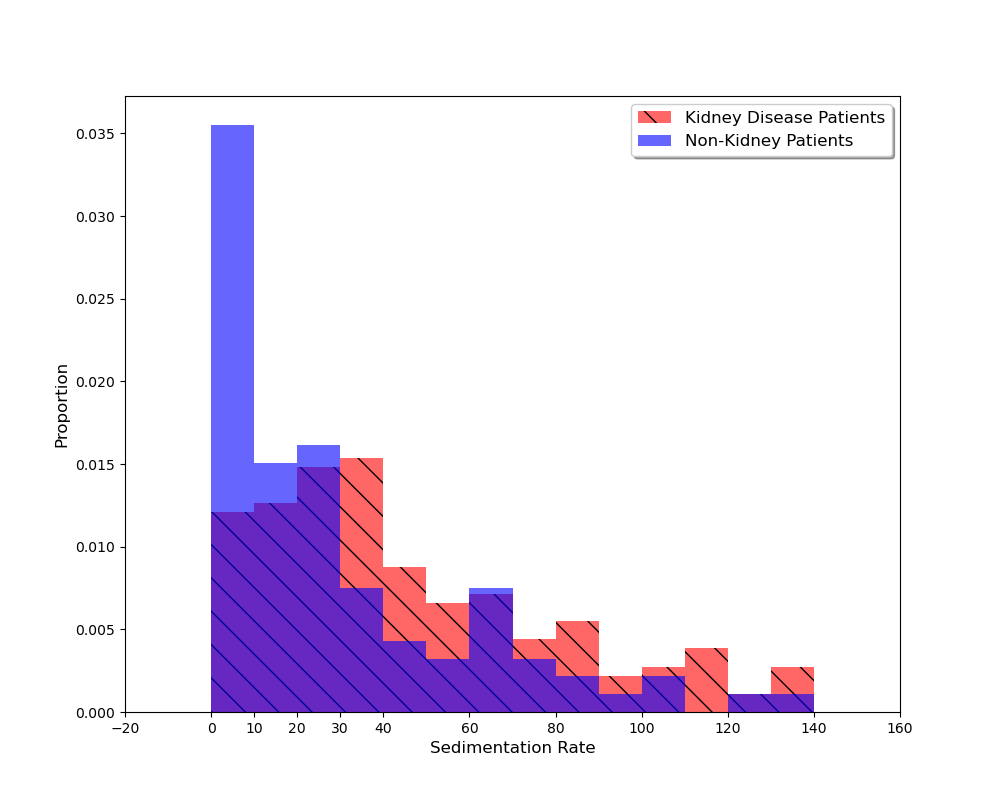
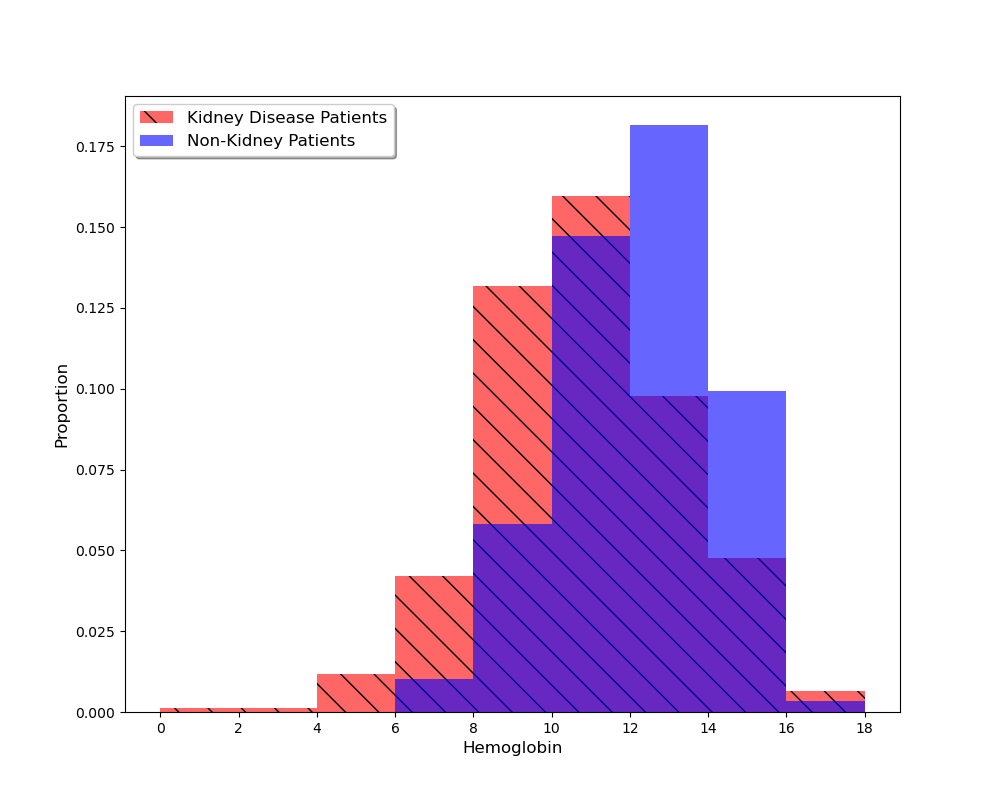

# IgA-Nephropathy

Team members: [Amelia Spivak](), [Unnati Nigam](), and [Steve Manns](https://github.com/manns79)

# Table of Contents
1. [Introduction](#introduction)
2. [Dataset Generation](#dataset-generation)
3. [Exploratory Data Analysis](#exploratory-data-analysis)
4. [Modeling](#modeling)
5. [Results](#results)

## Introduction

Add intro here

## Dataset Generation

Our study utilizes data from the fourth iteration of the Medical Information Mart for Intensive Care ([MIMIC-IV](https://physionet.org/content/mimiciv/3.1/)) database. MIMIC-IV is a freely accessible, de-identified electronic health record (EHR) database containing comprehensive information on hospital stays for patients at Beth Israel Deaconess Medical Center (BIDMC). The following files from MIMIC-IV were used to generate our data:
* labevents: Laboratory measurements sourced from patient derived specimens.
* d_labitems: Dimension table for labevents; provides a description of all lab items.
* diagnoses_icd: Billed ICD-9/ICD-10 diagnoses for hospitalizations.
* d_icd_diagnoses: Dimension table for diagnoses_icd; provides a description of ICD-9/ICD-10 billed diagnoses.

To construct our data from the files specified above, we first used d_icd_diagnoses to identify 88 `icd_codes` associated with a diagnosis of some form of kidney disease. With these `icd_codes` at hand, we were then able to use diagnoses_icd to identify the subgroup of patients that received a kidney disease diagnosis. This search yielded 41,386 different patients from which we randomly selected 1,000 for the purpose of analysis. For these 1,000 randomly selected patients with kidney disease, the next step was obtaining all of their lab measurements. In order to be able to work with a more manageable-sized dataset, we used d_labitems to determine the `itemdid` associated with all lab tests that were relevant to our study. This yielded 105 different `itemid` values (see `Data/Minimal Reducedlabitems - Reducedlabitems.csv`) that were used to filter the lab data for the 1,000 randomly selected patients with kidney disease. In other words, from the original labevents file, we extracted 105 different types of lab readings for each of the 1,000 patients. The result of this procedure was `Data/trimmed_kidney_disease_random_1000_patients.csv.gz`.

In addition to studying patients with some form of kidney disease, our analysis also included patients without a kidney disease diagnosis. We refrained from referring to this group as "healthy kidney patients", as it's possible that some of these patients had a form of kidney disease that went undiagnosed (e.g., their admission to BIDMC was due to a different medical problem). Therefore, we called this group "non-kidney patients". To qualify as a non-kidney patient, we strengthened our requirements on the diagnoses by expanding the number of `icd_codes` to 107. This implies that being included in the complement of the set of patients with kidney disease is a necessary but not sufficient condition for a patient to fall into the non-kidney category. Furthermore, due to the large size of MIMIC-IV and the important role played by serum creatinine, we also required that the patient had a serum creatinine lab reading. After imposing all of these conditions, 1,088 patients remained in the dataset. For these 1,088 non-kidney patients, we then extracted the same 105 different types of lab readings for each patient. The result was `Data/trimmed_normal_kidney_patients.csv.gz`.

Finally, for the purpose of further exploration, we sought to determine all diagnoses that the patients in our two datasets received. To accomplish this task, we searched through diagnoses_icd for the `seq_num`, `icd_code`, and `icd_version` associated with each diagnosis that a patient in one of our two datasets received. This information was stored in a Python dictionary to ensure that we had access to some of each patient's medical history. The result for the patients with kidney disease was `Data/kidney_disease_patients_diagnoses.json`, while the analogous result for non-kidney patients was `Data/normal_kidney_patient_diagnoses.json`.

The notebooks used to generate our datasets from the MIMIC-IV files may be found in the Data_Generation folder of this repository. The files containing the data may be found in the Data folder of this repository.

## Exploratory Data Analysis

As a first step in our exploratory data analysis (EDA), we sought to gather evidence that the health of the kidney disease and non-kidney patients was comparable (excluding the fact that patients in one group received a kidney disease diagnosis). Furthermore, we wanted to understand any minor differences that were identified between the two groups. Our approach to handling this task entailed analyzing the following three lab tests:
1. C-Reactive Protein (CRP) (`itemid` = 50889)
2. Sedimentation Rate (`itemid` = 51288)
3. Hemoglobin (`itemid` = 50811)

CRP and sedimentation rate are two measures of inflammation, which is a metaphor for how much illness there is to fight off in the body. Starting with CRP, we found that 324 kidney patients and 219 non-kidney patients in our dataset have a CRP reading. For these patients, we found their first CRP lab reading and used this data to produce the histogram shown below. Note that the additional tick marks included at 5 and 10 are intended to indicate the normal range. Namely, CRP readings equal to or greater than 8 mg/L or 10 mg/L are considered high (see: [Mayo Clinic](https://www.mayoclinic.org/tests-procedures/c-reactive-protein-test/about/pac-20385228)). Focusing on the normal range, roughly 10% of the non-kidney patients and 7% of the kidney disease patients had CRP readings between 0 mg/L and 5mg/L. Results for the remaining bins may be interpretted similarly. Importantly, the percentages for the two groups are comparable across the different bins, which agrees with the assertion that the health of the kidney disease and non-kidney patients is similar. Lastly, we remark that the abnormally high readings were present in the data, which was suspected to be an artifact of the patients being in an ICU. To avoid detracting from the data of interest (i.e., patients with reasonabl health), we chose to exclude CRP readings greater than 150 from the plot shown below. However, for the purpose of completeness, such readings are recorded here. For kidney patients, 26 had a CRP reading greater than 150. For non-kidney patients, 13 had a CRP reading greater than 150. 

Sedimentation rate was the next lab that was analyzed. As mentioned above, sedimentation rate is another measure of inflammation. According to the [Cleveland Clinic](https://my.clevelandclinic.org/health/diagnostics/17747-sed-rate-erythrocyte-sedimentation-rate-or-esr-test), values greater than 30 are considered high, although this can vary based on factors such as age and sex. In our dataset, there were 187 kidney patients with a sedimentation rate reading and 94 non-kidney patients with a sedimentation rate reading. The first sedimentation rate lab reading for these patients was extracted and used to create the histogram shown below. Based on the histogram, about 3.5% fall into the bin 0-10, while about 1.3% of the kidney patients fall into this bin. This is the most significant difference between the two groups, with percentages in the other bins differing by less than 0.5%. With that said, the sedimentation rate labs offer additional evidence that the health of the kidney and non-kidney patients is comparable. 

The final lab that was analyzed in the first part of our EDA was hemoglobin. Hemoglobin is a protein in red blood cells, and low hemoglobin levels may be an indication that a disease or condition is affecting the body's ability to produce red blood cells ([Cleveland Clinic](https://my.clevelandclinic.org/health/symptoms/17705-low-hemoglobin)). The consequence of low hemoglobin is that body doesn't get enough oxygen, which causes one to feel very tired and weak. What is considered the normal range for hemoglobin can vary slightly depending on sex, but 12 g/dL is considered low. In our dataset, 382 kidney patients had a hemoglobin reading and 148 non-kidney patients had a hemoglobin readings. Similar to the previous two labs, for this subset of patients, we extracted their first hemoglobin lab reading. The data obtained through this procedure is shown in the histogram below. Notice that the two histograms are roughly centered around the same value, but there are some noticeable differences between the two groups. To that end, kidney patients have relatively lower levels of hemoglobin, on average. We suspected that this observation was a consequence of a larger proportion of kidney patients having heart disease (relative to non-kidney patients).

## Modeling

Describe modeling approach here

## Results

Describe results here
