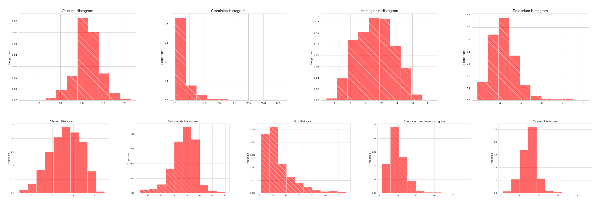
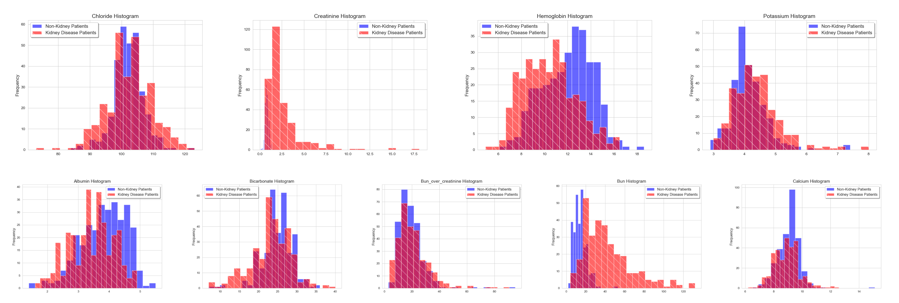
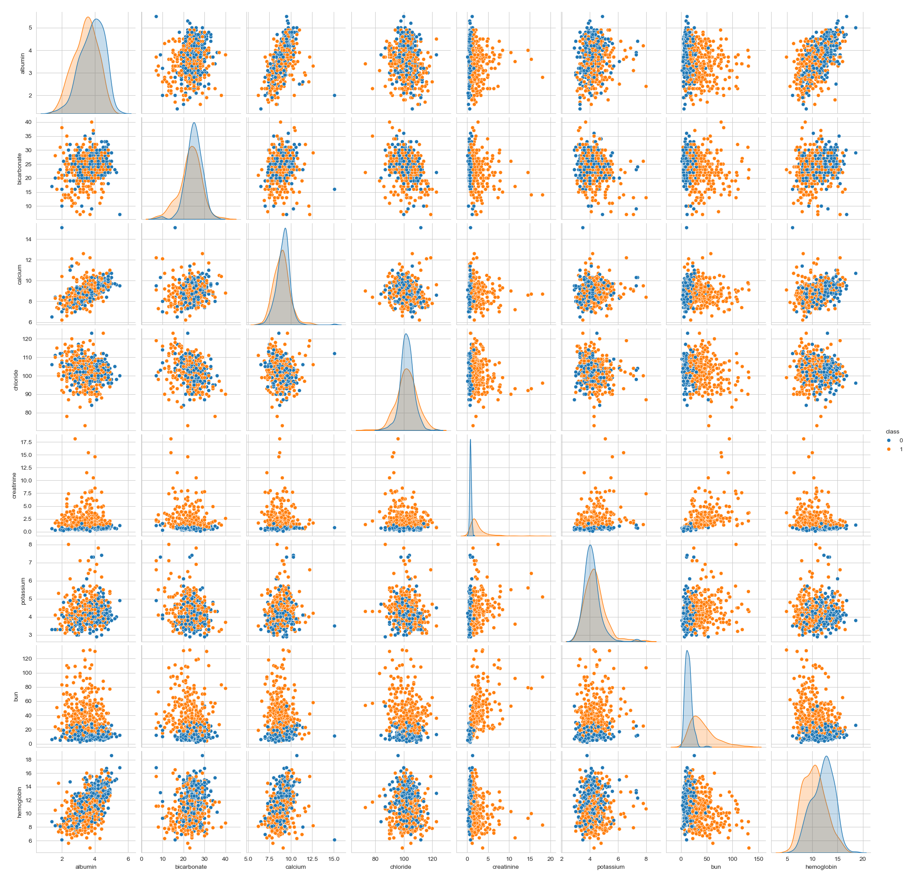

# IgA-Nephropathy

Team members: [Amelia Spivak](https://github.com/AmeliaSpivak) and [Steve Manns](https://github.com/manns79)

# Table of Contents
1. [Introduction](#introduction)
2. [Dataset Generation](#dataset-generation)
3. [Exploratory Data Analysis](#exploratory-data-analysis)
4. [Modeling](#modeling)
5. [Results](#results)

## Introduction

In the United States, over 130,000 people are newly diagnosed with Chronic Kidney Disease (CKD) each year. Swollen ankles or elevated blood pressure in a young person may lead to an investigation that results in a kidney diagnosis. But more often than not, kidney disease is symptom-free and only discovered accidentally through routine labs that pick up elevated levels of serum creatinine. 
The problem with this mode of discovery is that by the time serum creatinine levels are (confirmed to be) elevated the patient almost certainly has advanced kidney disease. What is needed is an earlier detection system, which will greatly increase chances of avoiding deterioration.  

A urine test can detect protein in the urine present in early kidney disease. But routine urine testing is no longer done in the US ([Span, 2019]( https://www.nytimes.com/2019/10/14/health/urine-tests-elderly.html), [Urine testing no longer routine, 2014](https://www.health.harvard.edu/diseases-and-conditions/urine-testing-no-longer-routine), and [Primack, 2010](https://publications.aap.org/aapnews/article-abstract/31/12/16/8114/AAP-does-not-recommend-routine-urinalysis-for?redirectedFrom=fulltext)). Most often a patient is offered a urine test only once kidney disease is strongly suspected. At this point, the disease is likely at an advanced stage.

The kidneys function to filter the blood of toxins and wastes resulting from digestion and breakdown of muscle tissue. Elevated serum creatinine in the blood indicates that the kidneys’ filtering mechanisms are impaired and not filtering this and other substances effectively from the blood. The kidneys have sustained damage and there is no treatment to repair these parts of the kidneys. Instead, treatment is aimed at preventing further damage to the kidneys and slowing down further loss of function. If kidney disease is diagnosed at a very advanced stage or left untreated the individual may progress to ESRD (End Stage Renal Disease) and require a kidney transplant or dialysis.

Diagnosing kidney disease early, before serum creatinine rises above the normal threshold would greatly increase the patient’s chances of avoiding the need for a kidney transplant. 

The question motivating this project is whether some other routine lab readings are associated with elevated serum creatinine. If some other lab test or collection of lab tests point to a high likelihood of elevated serum creatinine, then perhaps tracking these may allow for early prediction of kidney disease before serum creatinine is elevated. Determining this subset of routine labs that could  point to a strong risk of kidney disease would be especially useful to patient populations that undergo routine lab testing. Patients that regularly take medication for other ailments make up such populations. 

Data science and machine learning appear well suited for such an investigation and indeed we are not the first to try this. There are a number of projects on Kaggle dealing with this exact question of how to predict CKD early, with one published in 2023 in the Journal of Pathology Informatics (Elsevier): “[Chronic kidney disease prediction based on machine learning algorithms]( https://www.sciencedirect.com/science/article/pii/S2153353923000032),by Artiful Islam, Ziaul Hasan Majumder and Alomgeer Hussein).

The aim of our project is to improve on the 2023 work. The dataset they and all the Kaggle projects used were based on a UCI machine learning repository of 400 patients from a hospital in Tamil Nadu, India which includes results from urine tests and limited types of blood tests along with clinical information. Because they used tests that define kidney disease, serum creatinine and urine albumin to predict kidney disease, we were not surprised when our analysis showed that the other labs they included did not contribute further accuracy (see `Other_Notebooks/Analysis_Kaggle_CKD_400Dataset.ipynb`). We sought to obtain a larger dataset that includes more types of blood tests on which to conduct machine learning experiments.

Many of the routine labs whose association to kidney disease we sought to determine, are indeed known to be affected by kidney disease. But abnormal levels of these labs are considered non-specific for kidney disease. For example, low serum albumin is associated with proteinuria from kidney disease, but it can also be a sign of malnutrition, liver disease, or certain infections. Low hemoglobin is a sign of anemia, but the causes of anemia are myriad, only one of which is kidney disease. The physician faced with these kinds of lab results often takes a wait-and-see-approach rather than risk seeming incompetent by sending a patient off for a biopsy with a nephrologist. Wait-and-see means more time during which more irreversible kidney damage may occur. We turned to data science and machine learning to quantify the extent to which each of these lab tests was associated with kidney disease, with the aim of combining these weights into a tool of prediction for kidney disease. Such a tool would empower the physician to make the right referral to the right specialist and ward off advanced kidney diseases.

## Dataset Generation

Our study utilizes data from the fourth iteration of the Medical Information Mart for Intensive Care ([MIMIC-IV](https://physionet.org/content/mimiciv/3.1/)) database. MIMIC-IV is a freely accessible, de-identified electronic health record (EHR) database containing comprehensive information on hospital stays for patients at Beth Israel Deaconess Medical Center (BIDMC). The following files from MIMIC-IV were used to generate our data:
* labevents: Laboratory measurements sourced from patient derived specimens.
* d_labitems: Dimension table for labevents; provides a description of all lab items.
* diagnoses_icd: Billed ICD-9/ICD-10 diagnoses for hospitalizations.
* d_icd_diagnoses: Dimension table for diagnoses_icd; provides a description of ICD-9/ICD-10 billed diagnoses.

To construct our data from the files specified above, we first looked through the 112,109 code descriptions in d_icd_diagnoses to identify `icd_codes` associated with a diagnosis of some form of kidney disease. We found that in the d_icd_diagnoses some diagnoses show up under several different codes, and additionally, sometimes two different diagnoses are in essence the same. We identified 88 'icd_codes' that represented the full gamut of kidney disease diagnoses and that did not include many of the same diagnoses. With these `icd_codes` at hand, we were then able to use diagnoses_icd to identify 41,386 patients who received a kidney disease diagnosis. Extracting all of the lab data for these 41,386 patients from the labevents file proved to be a computationally expensive and time-consuming task; therefore, due to the time constraint imposed by the project deadline, we settled on taking a small sample from these 41,386 patients. Specifically, 1,000 patients were randomly drawn from the 41,386 for the purpose of analysis, with the intent of retrieving more data if time allowed. For these 1,000 patients with kidney disease, the next step was obtaining all of their lab measurements. In order to be able to work with a more manageable-sized dataset, we used d_labitems to determine the `itemdid` associated with all routine basic lab tests (CBC and CMP) as well as basic urine testing. This yielded 105 different `itemid` values (see `Data/Minimal Reducedlabitems - Reducedlabitems.csv`) that were used to filter the lab data for the 1,000 patients with kidney disease. In other words, from the original labevents file, we extracted 105 different types of lab readings for each of the 1,000 patients. The result of this procedure was `Data/trimmed_kidney_disease_random_1000_patients.csv.gz`. Given that generating this dataset took close to 24 hours to run on the [ASC Unity Cluster](https://osu.teamdynamix.com/TDClient/1929/ASC/KB/ArticleDet?ID=61538), we were not able to achieve our initial goal of retrieving additional data. However, we remark that our dataset for patients with kidney disease is by itself twice the size of the popular UCI machine learning repository kidney dataset. 

In addition to studying patients with some form of kidney disease, our analysis also included patients without a kidney disease diagnosis. We refrained from referring to this group as "healthy kidney patients", as it's possible that some of these patients had a form of kidney disease that went undiagnosed (e.g., their admission to BIDMC was due to a different medical problem). Therefore, we called this group "non-kidney patients". To count as a non-kidney patient, we needed to make sure that no kidney diagnosis code was assigned to the patient, and so we needed to include all kidney disease codes, expanding the number of `icd_codes` to 107. Thus, the non-kidney patients were patients who did not have any of the 107 diagnosis codes (which included the above-described 88). Furthermore, due to the large size of MIMIC-IV and the important role played by serum creatinine in defining kidney disease, we required that the patient have a serum creatinine lab reading. This requirement reduced our original set of 28,000, leaving 1,088 patients remaining in the dataset. For these 1,088 non-kidney patients, we then extracted the same 105 different types of lab readings for each patient. The result was `Data/trimmed_normal_kidney_patients.csv.gz`.

Finally, for the purpose of further exploration, we sought to determine all diagnoses that the patients in our two datasets received. To accomplish this task, we searched through diagnoses_icd for the `seq_num`, `icd_code`, and `icd_version` associated with each diagnosis that a patient in one of our two datasets received. This information was stored in a Python dictionary to ensure that we had access to some of each patient's medical history. The result for the patients with kidney disease was `Data/kidney_disease_patients_diagnoses.json`, while the analogous result for non-kidney patients was `Data/normal_kidney_patient_diagnoses.json`.

The notebooks used to generate our datasets from the MIMIC-IV files may be found in the Data_Generation folder of this repository. The files containing the data may be found in the Data folder of this repository.

## Exploratory Data Analysis

Patients in the ICU (Intensive Care Unit) are critically ill patients. We therefore expected that general measures of illness would find the two groups that make up our dataset, ICU patients with kidney disease and ICU patients without a kidney disease diagnosis, to be comparable in extent of illness. This assumption is important for our study as we seek to compare patient populations that are different only with regard to whether or not they have a kidney disease diagnosis or not. For example, comparing ICU patients with kidney disease to non-hospitalized people with no kidney disease would be very misleading, as lab results that reflect hospitalization would incorrectly show up as differences related entirely to kidney disease. As a first step in our exploratory data analysis (EDA), we conducted this check to confirm comparable health status using the following three lab tests:

1. C-Reactive Protein (CRP) (`itemid` = 50889)
2. Sedimentation Rate (`itemid` = 51288)
3. Hemoglobin (`itemid` = 50811)

CRP and Sedimentation rate are key biomarkers of inflammation in the body, with CRP being more informative about acute inflammation. Inflammation is the body's natural defense to infection, tissue injury, toxins, and autoimmune reactions. The extent of the body's defense through inflammation is a measure of the  magnitude of the assault the body has sustained and to which it is responding. Starting with CRP, we found that 324 kidney patients and 219 non-kidney patients in our dataset have a CRP reading. (The CRP test is regularly ordered as part of just about every first set of routine labs, so it was surprising to us to find that only a fraction of the patients in our dataset had this test run.) For these patients, we found their first CRP lab reading and used this data to produce the histogram shown below. Note that the additional tick marks included at 5 and 10 are intended to indicate the normal range. Namely, normal CRP readings are in the range of 0.1-5.0 mg/L, with 10 mg/L considered high (see: [Mayo Clinic](https://www.mayoclinic.org/tests-procedures/c-reactive-protein-test/about/pac-20385228)). Focusing on the normal range, roughly 10% of the non-kidney patients and 7% of the kidney disease patients had CRP readings between 0 mg/L and 5mg/L. Results for the remaining bins may be interpreted similarly. Importantly, the percentages for the two groups are comparable across the different bins, which agrees with the assertion that the health of the kidney disease and non-kidney patients is similar. Lastly, we remark that the very highest readings present in the data reflect mortality, an artifact of the grave prognoses seen in an ICU. To avoid detracting from the data of interest (i.e., patients with reasonable health), we chose to exclude CRP readings greater than 150 from the plot shown below. However, for the purpose of completeness, such readings are recorded here. For kidney patients, 26 had a CRP reading greater than 150. For non-kidney patients, 13 had a CRP reading greater than 150. 

Sedimentation rate was the next lab that was analyzed. As mentioned above, sedimentation rate is another measure of inflammation. According to the [Cleveland Clinic](https://my.clevelandclinic.org/health/diagnostics/17747-sed-rate-erythrocyte-sedimentation-rate-or-esr-test), the normal range is 0-16, with further restriction based on age and sex, and values greater than 30 are considered high. In our dataset, there were 187 kidney patients with a sedimentation rate reading and 94 non-kidney patients with a sedimentation rate reading. The first sedimentation rate lab reading for these patients was extracted and used to create the histogram shown below. Based on the histogram, about 3.5% fall into the bin 0-10, while about 1.3% of the kidney patients fall into this bin. This is the most significant difference between the two groups, with percentages in the other bins differing by less than 0.5%. With that said, the sedimentation rate labs offer additional evidence that the health of the kidney and non-kidney patients is comparable. 

The final lab that was analyzed in the first part of our EDA was hemoglobin. Hemoglobin is a protein in red blood cells that carries oxygen, and low hemoglobin levels may be an indication that a disease or condition is affecting the body's ability to produce red blood cells ([Cleveland Clinic](https://my.clevelandclinic.org/health/symptoms/17705-low-hemoglobin)). Blood loss can cause low hemoglobin and many patients in the ICU come to the ICU after experiencing blood loss. The normal range for hemoglobin in men is 13.5 - 17.3 g/dL, with a slightly lower range for women and children. In our dataset, 382 kidney patients had a hemoglobin reading and 148 non-kidney patients had hemoglobin readings. Similar to the previous two labs, for this subset of patients, we extracted their first hemoglobin lab reading. The data obtained through this procedure is shown in the histogram below. Notice that the two histograms are roughly centered around the same value, but there are some noticeable differences between the two groups. To that end, the kidney patients had relatively lower levels of hemoglobin, on average. Both sets of patients contained patients with heart disease, so this difference cannot be attributable solely to the representation of heart disease in these sets of patients.

As a second step in our EDA, we sought to:
- analyze feature distributions
- explore feature-target relationships
- examine relationships among the features

Importantly, this analysis was conducted using only the training data. In order to analyze the feature distributions, we constructed a histogram for each feature using all of the patients (in the training data). The result is shown in the figure below. The most noteworthy takeaway from this histogram is that the distribution of creatinine and bun are right-skewed. This is expected from a dataset where half of patients have kidney disease, as both high creatinine and bun are indicators for kidney disease. The figure shown below also indicates that, to a lesser extent, the distribution of potassium and calcium are also right-skewed. 

To explore feature-target relationships, we again constructed a histogram for each feature. However, in contrast to the plot shown above, this time we created a histogram for each of the two groups. That is, one histogram for kidney disease patients, and one histogram for non-kidney patients. These are shown in red and blue, respectively, in the figure below. Focusing for now on the creatinine histograms, notice that the non-kidney patients are clustered very tightly at low values of creatinine. On the other hand, the vast majority of the kidney disease patients lie entirely to the right of the non-kidney patient distribution. In other words, patients with kidney disease have noticeably higher levels of creatinine. As remarked above, this observation is expected. Looking next at the histograms for bun, a similar interpretation can be made. Namely, the majority of non-kidney patients lie to the left of roughly 30, while the majority of kidney disease patients lie to the right of that point. This is also consistent with our medical knowledge about kidney disease. All in all, the histograms for creatinine and bun lead to the expectation that these two features will play a critical role in being able to classify patients according to whether or not they have kidney disease. As for the remaining features, although medical knowledge leads one to expect that they should play a role in the classification, the figure shown below indicates that there significance is not nearly as great as creatinine and bun.

Lastly, to examine relationships among the features, we created the pair plot shown below. In this part of the analysis, we were particularly interested in the correlation among the different features. The usefulness of understanding the correlation among the different features is that it indicates which features are providing essentially the same information. For example, the first row of the pair plot shows that there is at least a mild correlation between albumin and calcium (third plot in this row) as well as between albumin and hemoglobin (last plot in this row). This observation can be confirmed by computing the correlation matrix, which in this case yields a correlation of 0.53 for albumin and calcium, and a correlation of 0.61 for albumin and hemoglobin. Therefore, given a model that includes albumin as a feature, one should expect little improvement from adding either calcium or hemoglobin (or both) to the model. Analogous interpretations can be made for the remaining rows of the pair plot, and such interpretations helped inform our modeling process. 

## Modeling

Based on our domain knowledge and the available data, nine different lab tests were considered as features during the modeling process. These were: albumin, bicarbonate, bun, bun/creatinine, calcium, chloride, creatinine, hemoglobin, and potassium. Although the EDA suggested that, excluding creatinine, bun would play a critical role in the classification, we considered a variety of combinations of these features. There were two purposes for considering different combinations of the nine features. First, from a medical perspective, the lab results that were selected as features are expected to provide a meaningful indication of kidney health. Therefore, it was of interest to see whether this expectation was lived out in practice. Second, the computational cost and time needed to fit additional models was low, so considering multiple combinations of the features offered a greater level of completeness with little additional expense. That being said, the combinations of the nine features that we considered are:
1. albumin
2. bicarbonate
3. creatinine
4. bun
5. bun/creatinine
6. albumin and bicarbonate
7. albumin and bun
8. albumin and bun/creatinine
9. albumin and creatinine
10. bicarbonate and bun
11. bicarbonate and bun/creatinine
12. albumin, creatinine, and bun
13. albumin, bicarbonate, and bun
14. albumin, bicarbonate, and bun/creatinine
15. albumin, bun, bicarbonate, and creatinine
16. albumin, bun, bicarbonate, chloride, and potassium

For each of the 16 combinations of features mentioned above, we used two different classification algorithms. These were logistic regression and k-nearest neighbors. While there are a variety of different classification algorithms that one may consider applying to the data, many of these are not appropriate in this case. This is because the requirement that the patients in our dataset have all of the necessary lab measurements taken on the same day significantly reduced the size of our dataset (i.e., reduced it down to 764 total patients). Therefore, machine learning algorithms which are designed to be used with large datasets can easily memorize our training set, but are not expected to generalize well to new unseen data. We demonstrated this point by using a gradient boosting classifier with albumin, bun, bicarbonate, calcium, chloride, hemoglobin, and potassium as features. Specifically, this gradient boosting classifier obtained 99.67% accuracy on the training set, with a 0.66% false negative rate. Such seemingly impressive metrics would make our results comparable to those in papers such as [Chronic kidney disease prediction based on machine learning algorithms](https://doi.org/10.1016/j.jpi.2023.100189); however, as part of an effort to produce models with a greater potential to generalize well, we stuck with logistic regression and k-nearest neighbors. 

Hyperparameter tuning was performed for each of the two classification algorithms that were applied to the data. For logistic regression, this entailed tuning the value of the inverse of regularization strength (`C`). The values of `C` that were tested were [0.001, 0.01, 0.1, 1, 10, 100], For k-nearest neighbors, this entailed tuning the value of the number of nearest neighbors (`n_neighbors`). The values of `n_neighbors` that were tested were 1, 2, ..., 20. All hyperparameter tuning was accomplished by using 5-fold cross-validation. In particular, the hyperparameter value with the highest average accuracy score was selected. It was the accuracy score, false negative rate, and interpretation of such classifiers that were considered when determining our best model and interpretting the results. As a final sanity check, the best model was evaluated on the test set to ensure that a comparable level of accuracy was obtained. 

## Results

Describe results here
